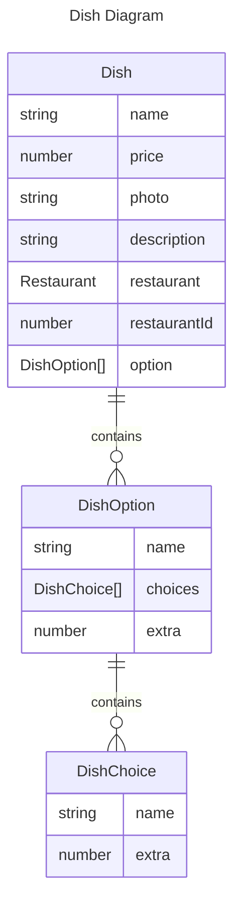

# DB Schema
[DB Schema](#db-schema) | [Resolver](#resolver)

[common](#common) | [user](#user) | [UserRole](#userrole) | [Verification](#verification) | [Restaurant](#restaurant) | [Category](#category) | [Dish](#dish) | [DishChoice](#dishchoice) | [DishOption](#dishoption) | [Payment](#payment) | [Order](#order) | [OrderItemOption](#orderitemoption) | [OrderItem](#orderitem)  

## common  
id: number;  
createdAt: Date;  
updatedAt: Date;  

## user
email: string;  
password: string;  
role: UserRole;  
verified: boolean;  
restaurants: Restaurant[]; //relation  
orders: Order[];  
payments: Payment[]; //relation  
riders: Order[]; //relation

### UserRole
'Client', 'Owner', 'Delivery', 'Any'

## Verification
code: string;  
user: User; //relation  

## Restaurant
name: string;  
coverImg: string;  
address: string;  
category: Category; //relation  
owner: User; //relation  
ownerId: number; //relation  
menu: Dish[]; //relation  
orders: Order[]; //relation  
isPromoted: boolean;  
promotedUntil: Date;  

## Category  
name: string;  
coverImg: string;  
slug: string; // 컬럼 유니크  
restaurants: Restaurant[]; //relation  

## Dish
name: string;  
price: number;  
photo: string;  
description: string;  
restaurant: Restaurant; //relation  
restaurantId: number; //relation  
options?: DishOption[]; //relation  
<details>
<summary>주문 쿼리 예</summary>
<div markdown="1">  

```json
{
  "menu": [
    {
      "name": "Mexican Chicken",
      "price": 12,
      "description": "Delicious",
      "options": [
        {
          "name": "spice level",
          "extra": null,
          "choices": [
            { "name": "Little bit" },
            { "name": "kill me" }
          ]
        },
        {
          "name": "Pickle",
          "extra": 1
        },
        {
          "name": "size",
          "extra": null,
          "choices": [
            { "name": "L", "extra": 2 },
            { "name": "XL", "extra": 2 }
          ]
        }
      ]
    }
  ]
}
```
</details>

<details>
<summary>Dish Diagram</summary>
<div markdown="1">  


</details>  

[Dish Resolver](#dish-1)  
### DishChoice
name: string;  
extra?: number;  

### DishOption
name: string;  
choices?: DishChoice[];  
extra: number;  

## Payment
transactionId: string;  
user: User; 
userId: number; 
restaurant: Restaurant;  
restaurantId: number;  

## Order
> ManyToMany 관계는 시작하는 엔티티에서 @JoinTable() 셋팅해줘야 함.    
> 

customer?: User;  
customerId: number;  //@RelationId  
driver?: User;  
driverId: number;  
restaurant?: Restaurant;  
items: OrderItem[];  
total: number;  
status: OrderStatus;  [^id]

> `@RelationId`: 1:N, N:N 관계의 연결된 엔티티의 ID만 가져온다.

### OrderItemOption  
name: string;  
choice: String;  

### OrderItem  
dish: Dish;  
options?: OrderItemOption[];  
  
# Resolver
[DB Schema](#db-schema) | [Resolver](#resolver)
# user
**createAccount(CreateAccountInput): CreateAccountOutput**  

**login(LoginInput): LoginOutput**  

**me(User): User**  

**userProfile( UserProfileInput ): UserProfileOutput**  

**editProfile( User, EditProfileInput): EditProfileOutput**  
`email` 만 업데이트 되는 경우, `password` 만 업데이트 되는 경우 같이 업데이트 되는 경우 지원할 것  

**verifyEmail(VerifyEmailInput): VerifyEmailOutput**  
입력받은 code로 Verify 테이블의 row를 지운다.

### UserRole
'Client', 'Owner', 'Delivery', 'Any'

# Restaurant
**createRestaurant(User, CreateRestaurantInput): CreateRestaurantOutput**  

**myRestaurants(User): MyRestaurantsOutput**  

**myRestaurant(User, MyRestaurantInput): MyRestaurantOutput**  

**editRestaurant(User, EditRestaurantInput): EditRestaurantOutput**  

**deleteRestaurant(User, DeleteRestaurantInput): DeleteRestaurantOutput**  

**restaurants( RestaurantsInput ): RestaurantsOutput**  

**restaurant(RestaurantInput): RestaurantOutput**  

**searchRestaurant(SearchRestaurantInput): SearchRestaurantOutput**  
***custom repository***  
src/restaurants/repositories/category.repository.ts

# Category  
**restaurantCount(Category): number**  

**allCategories(): AllCategoriesOutput**  

**category(CategoryInput): CategoryOutput**  

# Dish 
**createDish(User, CreateDishInput): CreateDishOutput**  

**editDish(User, EditDishInput): EditDishOutput**  

**deleteDish(User, DeleteDishInput): DeleteDishOutput**  

> `DishChoice`, `DishOption`, [Dish DB](#dish)

# Payment
**createPayment(User, CreatePaymentInput): CreatePaymentOuput**  
사용자가 프로모션 요금을 지불하면 일정 기간 동안 레스토랑 검색 시 해당 식당이 먼저  보여주도록 한다.

**getPayments(User): GetPaymentsOutput**  
결재 이력을 조회한다.

# Order
**createOrder(User, CreateOrderInput): CreateOrderOutput**  
order을 생성하고 orderId를 리턴한다.
- 레스토랑 조회
  - dishId 로 dish 목록 조회
  - 가격 합 계산
- publish: NEW_PENDING_ORDER

**getOrders(User, GetOrdersInput): GetOrdersOutput**  
요청사용자 UserRole 별로 주문 목록을 조회한다.

**getOrder(User,GetOrderInput): GetOrderOutput**
canSeeOrder 권한 체크 후 권한이 있으면 해당 주문을 리턴한다.

**editOrder(User, EditOrderInput): EditOrderOutput**
- canSeeOrder 권한과 롤 체크  
  - OrderStatus 체크  
  - 주문 업데이트  
  - publish: NEW_ORDER_UPDATE 

**takeOrder(User, TakeOrderInput): TakeOrderOutput**
드라이버가 이미 가져갔는지 확인 후 해당 주문에 드라이버 지정  
> publish: NEW_ORDER_UPDATE

**pendingOrders()** // Subscription  
**cookedOrders()** // Subscription  
**orderUpdates(OrderUpdatesInput)** // Subscription  

# Auth
**decorator**  
**guard**  

# jwt
**middleware**  
**dynamic module**  

# mail module